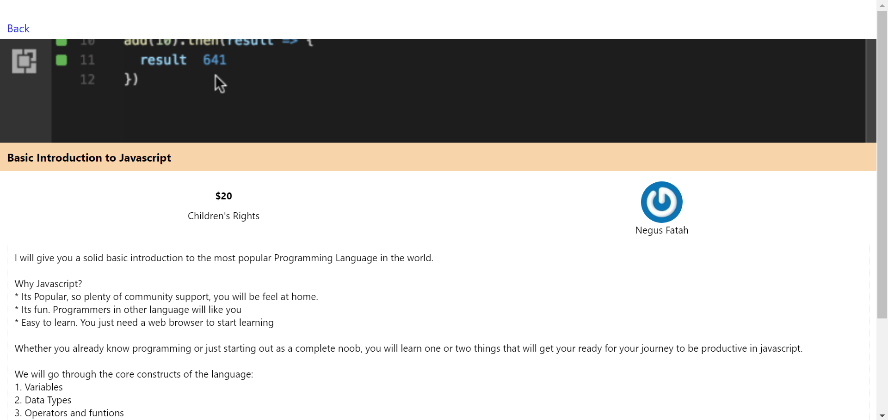
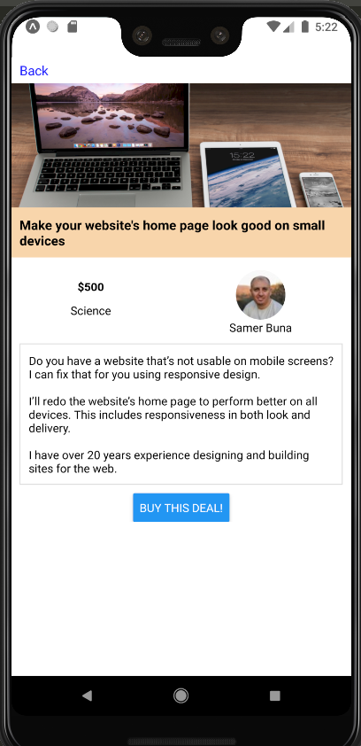

# Bakesale

This app shows all the deals offered by [Bakesale For Good](https://bakesaleforgood.com/), a marketplace for all kinds of products and services. It works on the web, iOS, and Android.

<table>
  <tr>
    <th colspan="2">Web</th>
  </tr>
  <tr>
    <td colspan="2"></td>
  </tr>
  <tr>
    <th>iOS</th>
    <th>Android</th>
  </tr>
  <tr>
    <td></td>
    <td></td>
  </tr>
</table>

## How to Run

1. [Clone](https://github.com/Abhiek187/Bakesale.git) this repo, `cd Bakesale`

2. `npm install`

3. Run `npm start` to bring up the Expo GUI and follow the steps to run on your respective platform.
